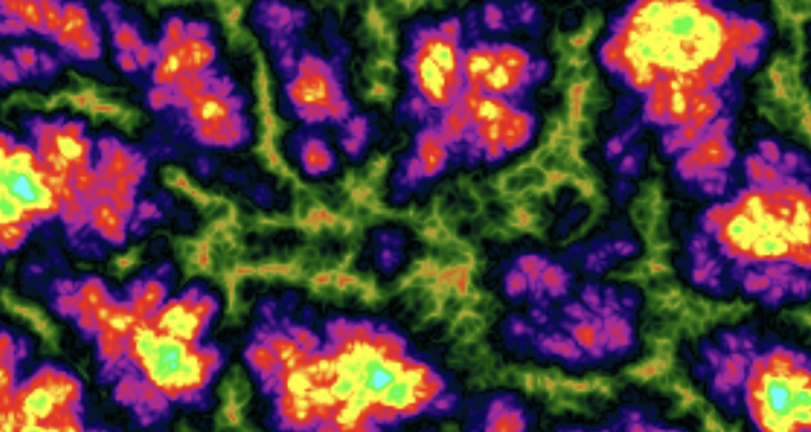

# Rainbow Noise Wallpaper

This is an HTML file that uses JavaScript, a Canvas, and Perlin Noise to generate a cool, mesmerizing artwork. Can be uploaded to Lively Wallpaper per se to have as your desktop background.

A screenshot of one of the frames, the terrain shifts over time. The algorithm uses 3D Simplex Noise specifically, with the x and y pixels as the first two dimensions and the epoch time as the 3rd. the range of colors from the peaks and troughs also changes over time but unoticably slow.

